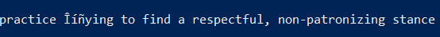
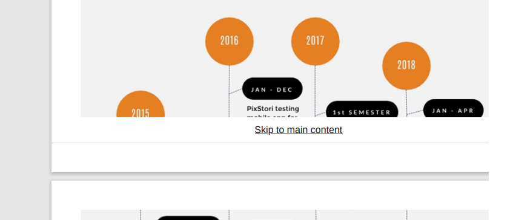
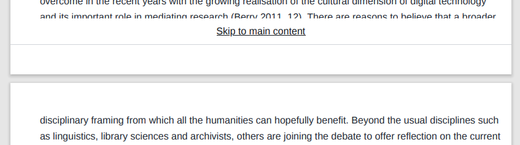

# Concerns

## .docx to .md

Markdown is an ambiguous format.
Word Document is also ambiguous.

### Loss of flexibility

### Loss of data

### Unicode

The character U+2013 "–" could be confused with the ASCII character U+002d "-", which is more common in source code.

can be translated to

### Page breaking

### Syntax conflicts

### Point-in-time dynamic parts

### Footnotes

at the end of a chapter or at the end of a current smallest part

### Pdf converters are not great

### Count of references can break the sequence

### A symbol can have a special meaning in a templating language

For example, `#Memorecord` or `_something`

# Difficult tradeoffs

## Which markdown spec to use?

### MyST (superset of CommonMark)

Pros
* made for scientific publications
* LATEX support
* extends Markdown with equations, cross-references, citations
* tools to export to a preprint or rich, interactive website or book

Cons
* MyST AST is in development; any structures or features present in the JSON schema may change at any time without notice
* no validators
* immature tools
* pandoc does not support MyST markdown spec (see https://github.com/executablebooks/rst2myst/issues/2)
* jupyter nbconvert does not support MyST markdown spec

### Unittest vs pytest

### Store media with other files or on separate server (maybe 3rd party service)

Using external server/service for storing media

Pros
* probably safer (giving permissions to access isolated storage only)
* easier to develop (no data loss and no ref changes during transformations, we always point to the same place)

Cons
* harder to deploy, especially if we were to deploy on our storage servers
* if we were to use 3rd party storage (eg imgur), there is a copywright 
